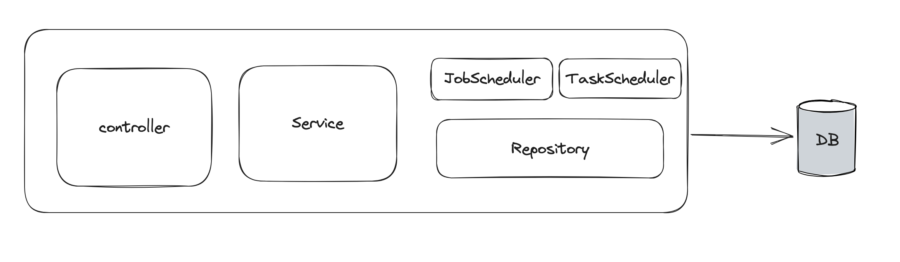

# Spring Boot 3 Scheduled Job Demo

This is a simple Spring Boot 3 demo integration with scheduled jobs creation at runtime using TaskScheduler.

## Architecture

## Tech Stacks

+ Spring Boot 3
+ Spring Data JPA
+ Postman
+ Maven
+ Lombok
+ MySQL
+ Docker
+ Spring Task Scheduler

## How to start

Start mysql in docker
```shell
docker run --name scheduled-db -e MYSQL_ROOT_PASSWORD=my-secret-pw -p 3306:3306 --rm mysql:latest
```

Start Application.

Import request collection to postman
`spring-boot-L3-scheduled-jobs.postman_collection.json`

Start with create a scheduled job and then check every minute, there will be a log in the application.
You can also check the database this job persists.

You can switch off the job by sending update request with `active:false`.

Followings are one payload and other cron expressions:

Payload for execution every minute.
```json
{
  "userId": 1,
  "cronExpression": "0 * * * * ?",
  "message": "take medicine",
  "active": true
}

```

+ Cron expression for every second: `*/1 * * * * ?`
+ Cron expression for 2 pm every day: `"0 0 14 * * ?` 